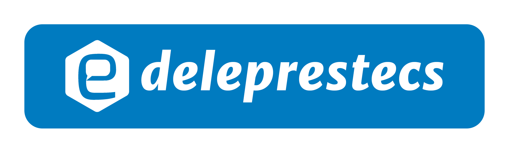
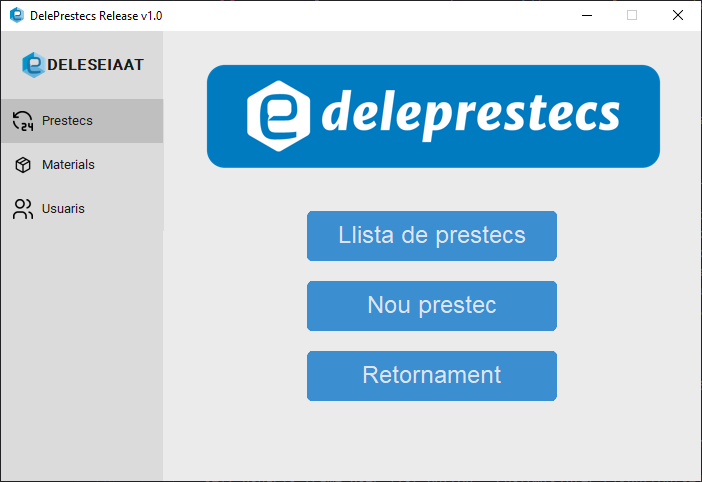

# Deleprestecs Release v1.0

## Descripción

Este proyecto es una aplicación diseñada para gestionar el préstamo de materiales y equipos en la delegación de estudiantes de ESEIAAT, La aplicación permite registrar, controlar y monitorear los préstamos de manera eficiente y sencilla.

## Estructura
    .
    ├── build
    │   └──...                
    ├── data  
    │   ├──materiales.json
    │   ├──prestamos.json
    │   └──usuarios.json   
    ├── dist 
    │    └──...                   
    ├── img
    │    └──...   
    ├── tools
    ├── LICENSE.md               
    ├── main.py
    └── README.md

## Releases

Puedes encontrar las releases en el apartado [Releases](https://github.com/IvanEncisoUPC/DelePrestecs/releases)

## Comenzando

Para comenzar con el script `main.py`, sigue estos pasos:

1. Clona el repositorio: `git clone https://github.com/IvanEncisoUPC/DelePrestecs.git`
2. Instala las dependencias requeridas: `pip install -r requirements.txt`
3. Ejecuta el script: `python main.py`

En el caso de usar una Release, simplemente ejecutar DelePrestecs.exe

## Uso

El script `main.py` proporciona una interfaz de usuario grafica con un menu segmentado en tres partes referentes a las tres ramas de las solicitudes de prestamo (prestamos, materiales y usuarios), teniendo cada uno de las ramas, las funciones de registrar, eliminar y visualizar.

## Contribuyendo

¡Las contribuciones son bienvenidas! Si encuentras algún problema o tienes sugerencias para mejoras, por favor abre un issue o envía un pull request.

## Licencia

Este proyecto está licenciado bajo la Licencia MIT. Consulta el archivo [LICENSE](LICENSE) para más detalles.
